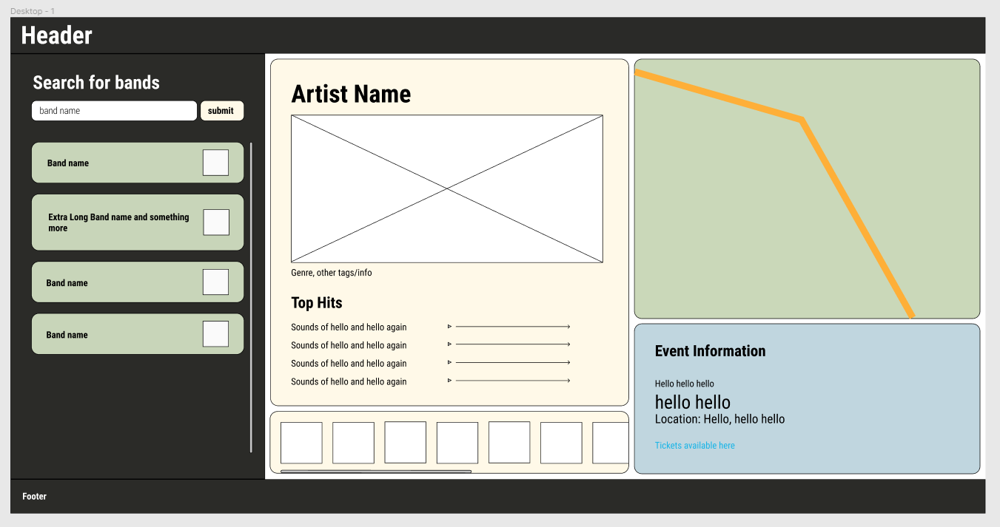

# BANDEAR

* [Description](#Description)
* [Usage](#Usage)
* [Technologies Utilized](#Technologies-Utilized)
* [BANDEAR](#BANDEAR)
* [Contact](#Contact)
* [License](#License)

## Description
I love music and frequently attend live music shows when I can, however I am sick of going to shows with uncertainty as to who I am seeing. I would like an app that allows me to search by band name, preview their music and see all upcoming events.

## Usage
* When loaded the page will:
    * On the left hand side show a history of your last 5 searches and views.
    * In the central panel introduce and explain the website.
    * On the right hand side show a google map with your location.
* Search for a band by key word.
* View the list of results on the left and listen to 30 second song previews.
* When an artist is clicked on the central panel will display artist information
    * The map will show event location.

The following image demonstrates the application functionality:

 

## Technologies Utilized
Primary technologies:
* Web API's (Spotify, Bandsintown API, google maps, and ipinfo.io)
* Moment.js
* jQuery
* Javascript
* Materialize 1.0.0
* HTML-5
* CSS-3

## BANDEAR

* Please find BANDEAR page here: <a href="https://chrisjmckeown.github.io/simone_william_tony_chris/" target="_blank">BANDEAR</a>

## Contact

* Please contact us at: 
    * Simone Cheah: simone_cheah@hotmail.com
    * William Woodburn: 
    * Tony Melek: tonymelek.au@gmail.com
    * Chris Mckeown: chris.j.mckeown@hotmail.com
    
  ## Link to Slides
    [Slide Show](https://docs.google.com/presentation/d/1GCubsO5xMH9TeXnAAwebHLnGM0IKQegNnpzyYpVBtgc/edit?usp=sharing)

## License

* See license here: <a href="https://github.com/chrisjmckeown/Weather_Dashboard/blob/master/LICENSE" target="_blank">license agreement</a>
