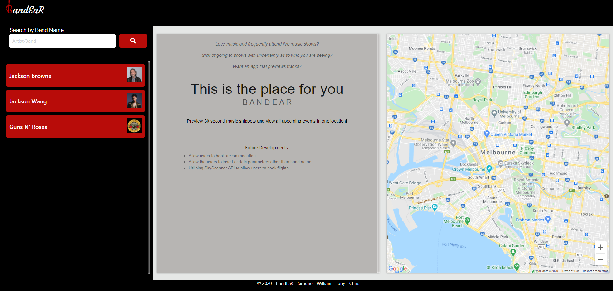

# BandEaR

* [Description](#Description)
* [Usage](#Usage)
* [Technologies Utilized](#Technologies-Utilized)
* [BandEaR](#BandEaR)
* [Contact](#Contact)
* [License](#License)

## Description
Scenario 1
* I love music and frequently attend live music shows when I can, however I am sick of going to shows with uncertainty as to who I am seeing. I would like an app that allows me to search by band name, preview their music and see all upcoming events.

Scenario 2
* As a music Promoter I am always looking to spread the word about upcoming gigs and shows. I need an application that allows users to sample various artists and easily figure out where and when these artists are performing.

## Usage
* When loaded the page will display:
    * Search and history on the left hand panel.
    * Information about the website including future development oportunities in the central panel.
    * A Google Map set to your location on the right hand panel.
* To search:
    * Enter a artist/band name and click search or hit the enter key.
    * A list of results will display below the search inputst.
    * Click on an artist to view information about them:
        * The central panel will display an: 
            * Image
            * Genres
            * Ablums
            * Top hits, with 30 second previews
        * The right hand side will show:
            * All upcoming events, when an event is selected the map will move to the event location, and display nearby accomodation:
            * Event information includes:
                * Date
                * Countdown
                * Venue name   
                * Location
                * and ticket purchase location  
            * Note: if there are no upcoming events, the map will default to you location and prove a message explaining there are no upcoming events.          

The following image demonstrates the application functionality:

 

## Technologies Utilized
Primary technologies:
* Web API's (Spotify, Bandsintown API, google maps, and ipinfo.io)
* Moment.js
* jQuery
* Javascript
* Materialize 1.0.0
* HTML-5
* CSS-3

## BandEaR

* Please find BandEaR page here: <a href="https://chrisjmckeown.github.io/BandEaR_Discover_live_artists/" target="_blank">BandEaR</a>

## Contact

* Please contact us at: 
    * Simone Cheah: simone_cheah@hotmail.com
    * William Woodburn: woodburn.william1@gmail.com
    * Tony Melek: tonymelek.au@gmail.com
    * Chris Mckeown: chris.j.mckeown@hotmail.com
    
## Link to Slides
[Slide Show](https://docs.google.com/presentation/d/1GCubsO5xMH9TeXnAAwebHLnGM0IKQegNnpzyYpVBtgc/edit?usp=sharing)

## License

* See license here: <a href="https://github.com/chrisjmckeown/BandEaR_Discover_live_artists/blob/master/LICENSE" target="_blank">license agreement</a>
